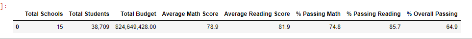
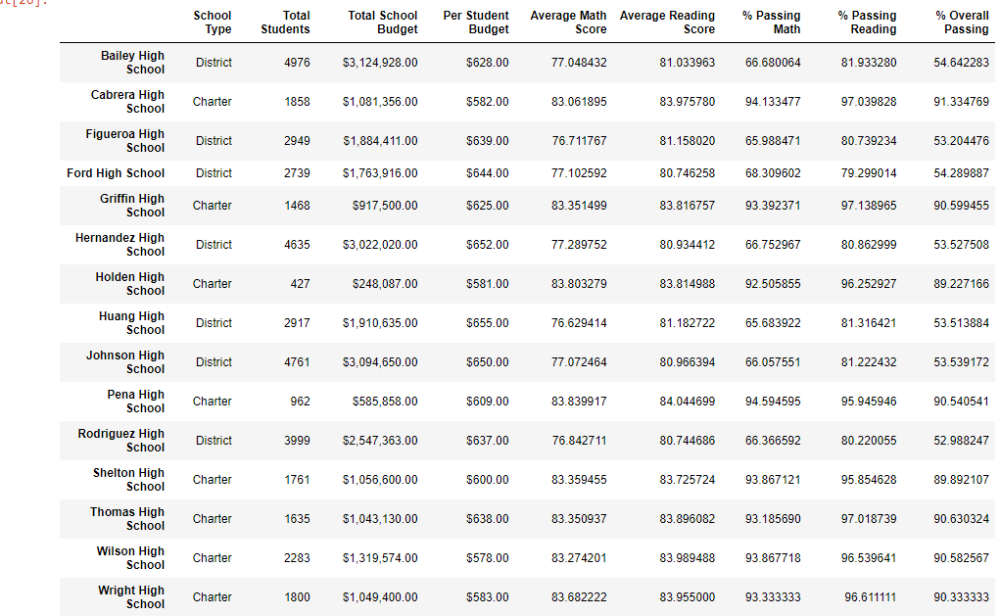
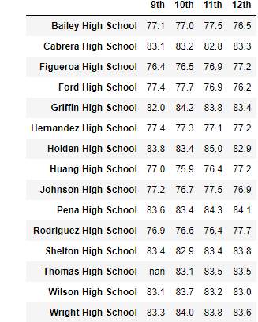
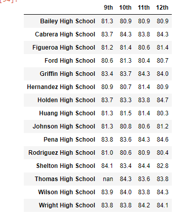
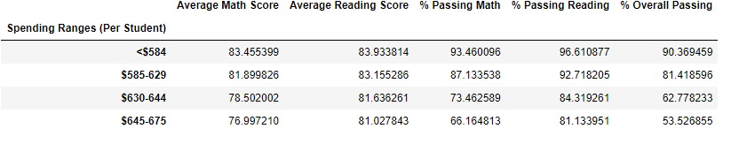
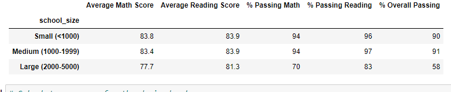
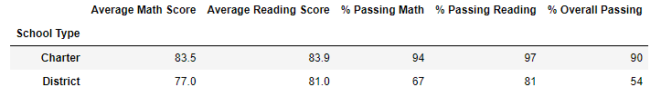

# School_District_Analysis
## Overview of school district analysis

The students_complete.csv file showed evidence that Thomas High School ninth graders' math and reading scores may have been altered, leading to the conclusion academic dishonesty had occurred. To maintain integrity, the Thomas High School ninth graders' math and reading scores had to be replaced with NaNs. Once replacement was completed, the school district analysis had to be repeated. This report shows the affects of the changes on the analysis.

## Results

-District Summary

Below is the district summary showing the affects of replacement of Thomas High School ninth graders' reading and math scores with NaNs.

-School Summary

Below is the school summary showing the affects of replacement of Thomas High School ninth graders' reading and math scores with NaNs.

-Math Scores by Grade

Below are the math scores by grade showing the affects of replacement of Thomas High School ninth graders' reading and math scores with NaNs.

-Reading Scores by Grade

Below are the reading scores by grade showing the affects of replacement of Thomas High School ninth graders' reading and math scores with NaNs.

-Scores by School Spending

Below are the scores by school spending showing the affects of replacement of Thomas High School ninth graders' reading and math scores with NaNs.

-Scores by School Size

Below are the scores by school size showing the affects of replacement of Thomas High School ninth graders' reading and math scores with NaNs.

-Scores by School Type

Below are the scores by school type showing the affects of replacement of Thomas High School ninth graders' reading and math scores with NaNs.

## Summary

Upon replacement of Thomas High School ninth graders' math and reading scores with NaNs, changes to school district analysis included the following:

-The district summary saw decreases in % Passing Math, % Passing Reading and % Overall Passing. 

-As one would expect, the Total Students value in the district summary decreased. 

-The math scores by grade DataFrame showed a NaN for Thomas High School 9th graders.

-The reading scores by grade DataFrame showed a NaN for Thomas High School 9th graders.